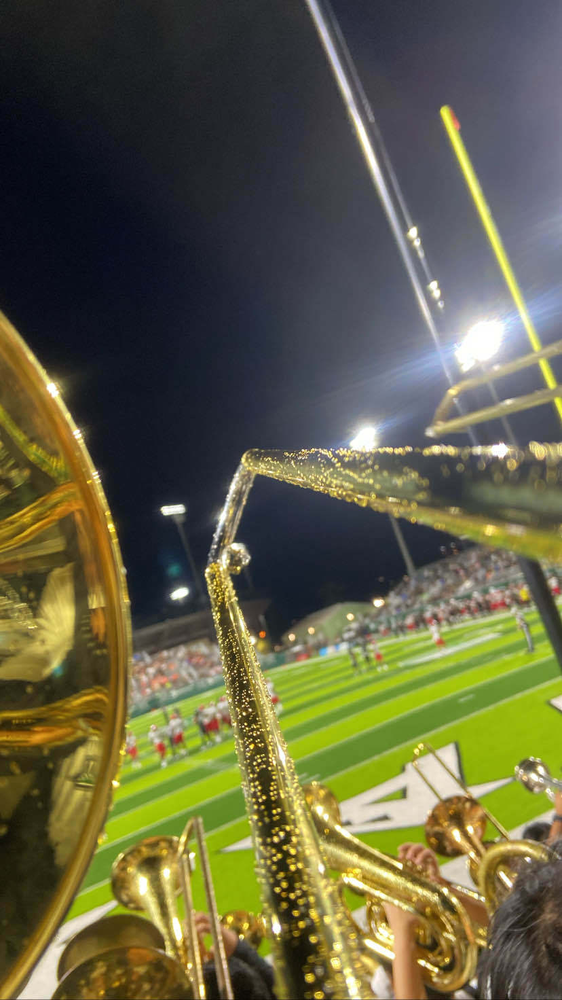

  
 

 In the first four semesters of studying here at UH Manoa, I had the great opportunity to join the UH Manoa Marching Band for the Spring semesters and the concert bands for the Fall semesters. Rehearsals were laid out in a 75-minute fashion spreading out to three days a week during football season. Memorization of music and marching charts along with marching techniques and choreographies were absorbed per every rehearsal. When it came to the football games, frequently on almost every Saturday, I would perform with the band beginning from that day's morning rehearsal until reaching late night when the game ends. A marching performance paired with playing within the stands made sure that our music energized the crowd and team. During the Spring and Fall semesters also included Pep Band performances where the band would play inside the stands playing music for our Men's and Women's Basketball and Volleyball teams. The heart of the band, our dear director, Gwen Nakamura, directed these performances with a cheerful and enthusiastic dedication. 

The Spring semester was mainly catered to concert performances. I would attend rehearsals twice a week, making sure I'd read the familiarized myself with the music beforehand. It was not as intense as marching band as there were fewer components to act on but it allowed me to focus more deeply to be connect with the music and be part of an ensemble.
  
  
The band experience was an exhilarating time meeting new people, learning new skills, and discovering potential both personally and musically. It was a unique opportunity to be a part of something larger than myself, contributing to a sense of community and a shared passion for music. Although I'm no longer in the band, the time I've invested and the memories along with the experiences I've gained left a lasting impact on me. As I also was in band in high school, the difference between these two calibers were night and day. I can confidently say that the UH Manoa band as a whole has influenced me to carry on a new approach to teamwork, discipline, and passion in everything I do. 

